# OperatorOS

OperatorOS is a video-first multimodal learning assistant for manufacturing equipment.

It lets a learner upload a machine video or ingest a YouTube video, pause on the exact moment they care about, draw on the frame, attach PDF manuals, and ask questions in plain language. OperatorOS combines the paused frame, the user's markings, nearby transcript, selected manuals, and recent conversation context to produce a visual answer. When the user asks to track a part, or when the vision model suggests tracking, OperatorOS can run SAM3 and generate a new highlighted video clip from the paused point to the end of the source video.

The current version is a local development/demo system. It is designed to prepare learners before hands-on machine training, not to replace a trained technician or machine-specific safety supervision.

## What OperatorOS Does

- Accepts local MP4 uploads and YouTube URLs.
- Stores a local working copy of each video so the system can extract frames, transcribe audio, and run tracking.
- Uses Whisper for timestamped transcription when available, with deterministic fallback timestamp segments when Whisper is disabled or fails.
- Lets the user pause the video and draw rectangles, circles, arrows, freehand paths, or text annotations over the frame.
- Sends the original paused frame, optional annotated snapshot, annotation JSON, transcript window, selected PDF manuals, and conversation history to a vision-language model through OpenRouter.
- Expects the VLM to return structured JSON containing the answer, visual annotations, an optional SAM3 tracking prompt, and optional tracking annotations.
- Renders model-generated annotations over the paused video frame.
- Starts SAM3 tracking when the user explicitly asks for tracking, when automatic tracking is enabled, or when the VLM returns a tracking target.
- Stores frame-by-frame SAM3 mask polygons as independently visible tracking layers over the clean video, while retaining a rendered H.264 fallback artifact.

## How It Works

```mermaid
flowchart TD
    A["1. User Input Layer<br/><br/>Video: local MP4 or YouTube URL<br/>Manual: selected PDF document<br/>Question: what the learner asks<br/>Annotation: boxes, circles, arrows, pen marks, or text<br/>Paused moment: the exact video time being discussed"]

    B["2. System Preparation Layer<br/><br/>Video service stores the source MP4<br/>Whisper creates timestamped transcript segments<br/>If Whisper fails, fallback timestamp segments are created<br/>Frontend captures the current paused frame<br/>Frontend can also capture an annotated snapshot<br/>RAGVLM stores the original PDF directly"]

    C["3. VLM Context Package<br/><br/>OperatorOS sends the VLM:<br/>the question<br/>the paused frame image<br/>annotation JSON in 0-1000 coordinates<br/>optional annotated snapshot<br/>nearby transcript window<br/>selected original PDF files<br/>recent conversation memory"]

    D["4. VLM Reasoning Layer<br/><br/>OpenRouter VLM, default Gemini 3.1 Pro Preview<br/>Reads the visible frame first<br/>Uses annotations to understand what the user means<br/>Uses transcript for nearby spoken context<br/>Reads attached PDFs directly for manual-grounded claims<br/>Returns structured JSON"]

    E["5. VLM Output<br/><br/>answer: text shown in chat<br/>annotations: visual marks shown over the paused frame<br/>tracking_prompt: optional text target for SAM3<br/>tracking_annotations: optional box or shape target for SAM3"]

    F{"6. Should SAM3 tracking start?"}

    G["No Tracking Path<br/><br/>The flow ends after the chat answer and visual overlay."]

    H["7. SAM3 Tracking Input<br/><br/>Tracking starts when:<br/>user asks to track, follow, trace, or monitor<br/>or auto-tracking is enabled<br/>or the VLM returns a tracking target<br/><br/>Target priority:<br/>1. VLM tracking annotation box<br/>2. VLM tracking text prompt<br/>3. user's original tracking question"]

    I["8. SAM3 Segmentation And Tracking<br/><br/>Orchestrator calls the SAM3 service<br/>SAM3 clips the source video from the paused timestamp<br/>Box-prompted SAM3 runs when a usable box exists<br/>Text-prompted SAM3 runs when only a description exists<br/>SAM3 segments and tracks the target frame by frame"]

    J["9. Tracking Layer Output<br/><br/>Masks are stored with stable object IDs and source timestamps<br/>Frontend adds each object as a removable canvas layer<br/>Multiple tracking rounds remain independently visible<br/>A rendered H.264 artifact remains available as a fallback"]

    A --> B --> C --> D --> E --> F
    F -- "No" --> G
    F -- "Yes" --> H --> I --> J
```



## Main User Flow

1. The learner uploads a local MP4 file or pastes a YouTube URL.
2. The video service stores a source MP4, extracts 1 FPS reference frames, writes metadata, and creates a transcript.
3. The learner plays the video and pauses when a useful machine part is visible.
4. The learner can draw on the frame to show what they mean.
5. The learner asks a question and can select one or more uploaded PDF manuals.
6. The frontend captures the current frame and optionally captures a second image with the user's markings visible.
7. The orchestrator forwards the full question context to the RAGVLM service.
8. The RAGVLM service sends the prompt, frame image, optional annotated image, selected PDF files, transcript window, and conversation context to the selected VLM.
9. The VLM returns a structured answer with optional visual annotations and optional tracking instructions.
10. The frontend displays the answer and overlays the model's visual annotations.
11. If tracking is requested or enabled, SAM3 stores the target masks and the frontend adds each tracked object to the layer checklist.

## Current Architecture

- `frontend/` - Next.js user interface with video playback, drawing tools, chat, document selection, transcript display, and tracking status.
- `services/orchestrator/` - FastAPI gateway that connects the frontend to video, RAGVLM, and SAM3 services. It also manages rolling conversation memory, chat logging, tracking events, and video proxying.
- `services/video-service/` - FastAPI service for local video uploads, YouTube ingestion through `yt-dlp`, media validation, Whisper transcription, fallback transcript generation, 1 FPS frame indexing, metadata, and seekable source-video streaming.
- `services/ragvlm-service/` - FastAPI service that stores uploaded PDF originals, builds the VLM prompt, attaches selected PDFs directly to the OpenRouter request, streams model output, and normalizes visual-answer behavior.
- `services/sam3-service/` - FastAPI service for SAM3 segmentation and tracking. It loads Ultralytics SAM3 predictors, clips the source video from the selected timestamp, runs box- or text-prompted tracking, renders masks into video frames, and outputs H.264 MP4.
- `workers/` - Optional RQ worker path for queued tracking jobs. Local development defaults to direct service calls.

## Important Implementation Details

OperatorOS is no longer using text-chunk or embedding-based manual retrieval. Uploaded PDFs are stored as original files and attached directly to the VLM request as native PDF file inputs. The model is instructed to read those PDFs directly and avoid inventing manual-specific claims when the files do not contain enough evidence.

The paused frame is captured by the browser from the actual video player at the moment the user asks. User annotations are sent as normalized `0-1000` JSON coordinates. If the `Send Annotated Snapshot` option is enabled, the system also sends a second image where those annotations are visibly drawn on top of the frame.

SAM3 does not depend on the VLM returning a perfect bounding box. If the VLM returns `tracking_annotations`, OperatorOS can convert those into box prompts. If no usable box exists, it can use the VLM's `tracking_prompt`, or the user's original tracking request, as a text prompt.

The primary SAM3 output is now a non-destructive set of frame-synchronized polygon layers over the clean source video. Each tracking round appends independently selectable objects, so earlier tracks can be hidden or removed without rerunning later rounds. The service still creates rendered and clean clip artifacts as compatibility fallbacks.

## Quick Start

1. Copy `.env.local.example` to `.env` and fill in `OPENROUTER_API_KEY`.
2. Install local dependencies:

   ```bash
   npm run setup
   ```

3. Start all local services without Docker:

   ```bash
   npm run dev
   ```

4. Open the local URL printed by Next.js (normally `http://localhost:3000`; if
   that port is already occupied, Next.js automatically selects the next one).

Docker Compose is still available:

```bash
docker compose up --build
```

The default local path is no-Docker development. The launcher reads the repository `.env` when starting Python services so stale terminal variables are less likely to override the demo configuration.

## Configuration Notes

- `OPENROUTER_API_KEY` is required for VLM answers.
- `OPENROUTER_PDF_ENGINE=native` is the default PDF handling mode.
- The default VLM model is `google/gemini-3.1-pro-preview`.
- `WHISPER_ENABLED=true` enables Whisper transcription. If Whisper cannot run, the video service writes fallback timestamp segments so the rest of the system can still operate.
- Real SAM3 tracking expects a local Ultralytics-compatible checkpoint at `models/sam3.pt`, or a path set by `SAM3_CHECKPOINT_PATH`.
- `SAM3_MAX_PROPAGATION_FRAMES=0` means process the full remaining video after the paused timestamp. Set a positive value to cap tracking length for faster demos.
- Keep `SAM3_ALLOW_SIMULATION_FALLBACK=false` for real demos. Simulation is only for development.
- `USE_WORKER_QUEUE=false` uses direct service calls. Set it to `true` only when Redis/RQ workers are configured.

## SAM3 Setup

Install SAM3 dependencies on the machine that will run tracking:

```bash
npm run setup:sam3
```

On Windows with an NVIDIA GPU, install CUDA 12.6 PyTorch wheels after SAM3 dependencies:

```bash
npm run setup:sam3:cuda
```

Check the runtime before a real demo:

```bash
npm run diagnose:sam3
```

The diagnostic should show CUDA available, the expected GPU, and an existing `models/sam3.pt` checkpoint.

## Development Endpoints

- Frontend: `http://localhost:3000`
- Orchestrator API docs: `http://localhost:8000/docs`
- RAGVLM service API docs: `http://localhost:8001/docs`
- Video service API docs: `http://localhost:8002/docs`
- SAM3 service API docs: `http://localhost:8003/docs`
- YouTube diagnostics: `http://localhost:8002/diagnostics/ytdlp`

## Current Limitations

- Rendered fallback tracking clips currently do not preserve original audio; interactive layer playback uses the clean source video and keeps its audio.
- Overlay manifests are currently stored as one JSON file per job; very long or object-heavy videos may require chunked or compressed mask storage.
- Long, high-frame-rate videos can take significant time to process.
- Generated tracking videos are stored locally; automatic cleanup is not yet implemented.
- Manual understanding depends on the selected VLM's native PDF-reading ability.
- OperatorOS is a learning and preparation tool. Safety-critical procedures still require qualified human supervision.
