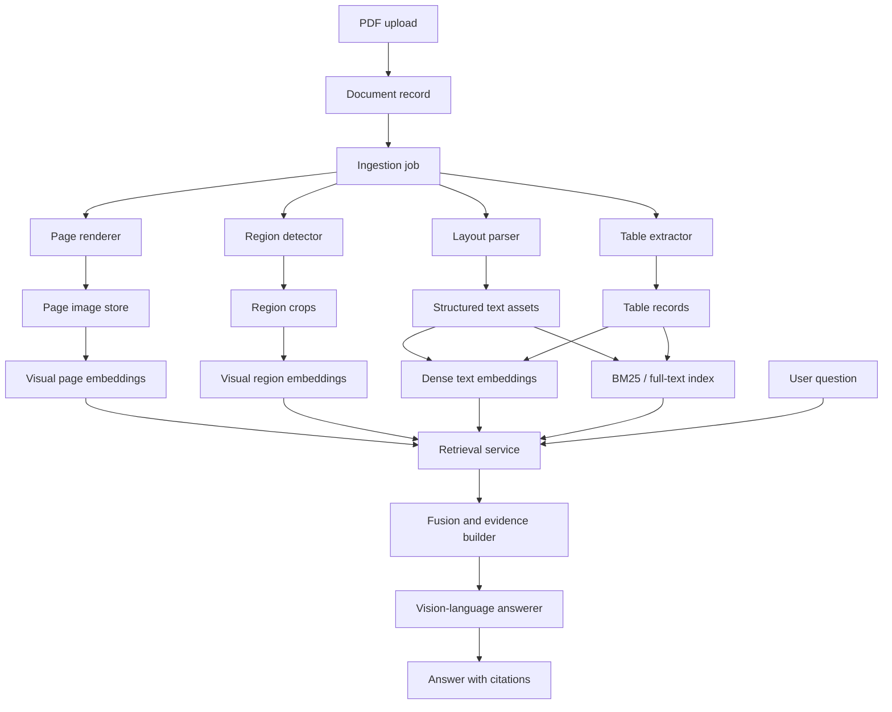

# Multimodal RAG

## Product Requirements Document

**Product area:** OperatorOS knowledge and document intelligence  
**Feature:** Multimodal RAG for visually rich operational documents  
**Document status:** Draft PRD  
**Last updated:** 2026-07-27  
**Reference case:** Bambu Lab P1S quick-start manual

---

## 1. Summary

OperatorOS needs a retrieval and question-answering system that can understand operational documents containing diagrams, screenshots, tables, labels, arrows, callouts, instructions, and page layouts. Traditional text-only RAG is insufficient because it depends on OCR, chunking, and text embeddings. That approach loses spatial relationships and often corrupts the exact information users need from manuals and operating procedures.

This feature, **Multimodal RAG**, will ingest visually rich documents and make them searchable through a hybrid retrieval pipeline:

1. Render every page as an image.
2. Parse structured text, headings, tables, captions, and layout.
3. Index visual page images.
4. Index important visual regions such as diagrams, screenshots, warning boxes, and tables.
5. Index structured text with dense embeddings.
6. Index exact text with BM25 or full-text search.
7. Fuse visual, semantic, and lexical search results.
8. Pass original page images, visual crops, and structured text to a vision-language model.
9. Return answers with page, figure, table, and region citations.

The first concrete reference document is the Bambu Lab P1S quick-start manual. It contains labeled printer diagrams, AMS assembly illustrations, software screenshots, warnings, and specification tables. This makes it a strong test case because different user questions require different retrieval modes:

- Text-only retrieval for warnings and simple specs.
- Visual retrieval for component location and assembly routing.
- Table-aware retrieval for printer specifications.
- Hybrid retrieval for questions combining diagrams and written instructions.

The core design principle is:

> Retrieve visually, enrich structurally, and answer from the original evidence.

---

## 2. Problem Statement

OperatorOS users will upload operational documents such as user manuals, SOPs, setup guides, maintenance guides, equipment datasheets, wiring guides, service checklists, training material, and safety documentation. Many of these documents are not primarily prose. Their meaning is distributed across:

- Page layout.
- Diagrams.
- Arrows and callouts.
- Labeled components.
- Screenshots.
- Tables.
- Warning blocks.
- Numbered step illustrations.
- Captions and nearby instructions.

A text-only RAG pipeline typically works like this:

```text
PDF
  -> OCR
  -> text chunks
  -> embeddings
  -> cosine similarity search
  -> LLM answer
```

This fails for diagram-heavy manuals because:

- OCR extracts labels but not what they point to.
- Spatial relationships are lost.
- Arrows, icons, color highlights, and connector routes are flattened away.
- Tables may be corrupted or detached from row and column headers.
- Screenshot UI flows are hard to understand from OCR alone.
- Small labels, part names, and cable names may be misread.
- Answers may cite a chunk that contains nearby text but not the actual visual evidence.

Using the Bambu P1S manual as the reference case:

- A query like "Where is the excess chute?" requires understanding a labeled diagram.
- A query like "Where does the 370 mm PTFE tube connect?" requires visual routing from an assembly illustration.
- A query like "When can I remove the protective foam under the hot bed?" is mostly textual but must cite the correct setup step.
- A query like "What is the input voltage?" is best answered from a normalized specification table.
- A query like "Which screen confirms that printer binding succeeded?" requires screenshot understanding.

OperatorOS needs a document intelligence feature that handles all of these patterns reliably.

---

## 3. Goals

### 3.1 Product Goals

1. Let users ask natural-language questions about visually rich operational documents.
2. Return answers grounded in the actual document evidence, not inferred from general model knowledge.
3. Support visual, textual, and tabular knowledge in one retrieval and answering workflow.
4. Provide citations users can inspect, including page number and visual region when available.
5. Make document ingestion reusable so each uploaded manual can support repeated Q&A.
6. Support progressive enhancement: start with page-level retrieval, then add region and table retrieval.
7. Establish an evaluation framework that measures retrieval quality separately from answer quality.

### 3.2 User Goals

Users should be able to:

- Ask how to assemble, operate, configure, or troubleshoot equipment from uploaded documents.
- Find the correct page or diagram without manually scanning a PDF.
- Understand which component, cable, port, button, or UI screen the manual refers to.
- Get direct answers with enough citation detail to verify the source.
- Compare or retrieve specifications from tables.
- Ask follow-up questions within the same document context.

### 3.3 Business Goals

1. Make OperatorOS useful for operational teams that depend on manuals and SOPs.
2. Reduce the time users spend searching through technical documents.
3. Create a foundation for future capabilities such as guided procedures, maintenance copilots, troubleshooting assistants, and document-driven training workflows.
4. Differentiate OperatorOS from text-only document chat systems.

---

## 4. Non-Goals

The initial version will not:

1. Automatically build a full knowledge graph from every diagram.
2. Guarantee perfect understanding of all visual schematics, wiring diagrams, CAD drawings, or exploded views.
3. Fine-tune a custom visual retriever.
4. Replace human validation for safety-critical or warranty-sensitive actions.
5. Perform live device control.
6. Infer steps not present in the provided document.
7. Support video, audio, or 3D model ingestion.
8. Support cross-document agentic reasoning in the MVP.
9. Act as a general web search system.

---

## 5. Target Users

### 5.1 Primary Users

**Operators and technicians**

- Need fast answers while setting up, repairing, configuring, or operating equipment.
- Ask practical questions such as "Where does this cable connect?" or "Which screw do I remove?"

**Operations managers**

- Need staff to follow consistent procedures from approved documentation.
- Care about citation, auditability, and safety warnings.

**Support teams**

- Need to answer customer or internal questions using official product manuals.
- Care about exact references, page numbers, and repeatability.

### 5.2 Secondary Users

**Training teams**

- Need to turn manuals and SOPs into guided learning workflows.

**Documentation teams**

- Need to find gaps, ambiguities, and visual-document issues in manuals.

**Developers and system integrators**

- Need APIs for document ingestion, retrieval, and grounded question answering.

---

## 6. Reference Case: Bambu P1S Manual

The Bambu P1S manual is the first test document for this feature. It includes several document patterns OperatorOS should support.

### 6.1 Labeled Component Diagrams

The manual labels physical printer components such as:

- Tool head.
- SD card slot.
- Screen.
- Air filter.
- Camera.
- Build plate.
- Excess chute.
- Power socket.

The answer depends on both the text label and the label's visual location on the printer image.

Example questions:

- "Where is the excess chute?"
- "Where is the power socket located?"
- "What component is near the build plate?"

### 6.2 AMS Diagrams

The manual includes AMS component diagrams with labels such as:

- Filament inlet.
- Filament outlet.
- Buckle.
- Desiccant area.
- Bambu Bus interface.

Example questions:

- "Where is the filament outlet on the AMS?"
- "Which connection is below the Bambu Bus port?"
- "Where does the AMS connect to the printer?"

### 6.3 Visual Assembly Instructions

Assembly pages include arrows, highlighted screws, component removal steps, cable routing, and visual tool references.

Example questions:

- "Which screws must be removed before unlocking the hot bed?"
- "Which Allen key is used to remove the transport screws?"
- "Where does the 370 mm PTFE tube connect?"
- "How are the 4-pin and 6-pin Bambu Bus cables connected?"
- "Which packing materials must be removed from the tool head and excess chute?"

### 6.4 Screenshot-Based Workflows

The manual includes application screenshots for binding the printer, starting the first print, using Bambu Handy, and using Bambu Studio.

Example questions:

- "Which screen confirms that printer binding succeeded?"
- "Where is the Send button in Bambu Studio?"
- "What should I tap after scanning the QR code?"

### 6.5 Specification Tables

The manual includes table-style specifications for body, toolhead, temperature, speed, camera, connectivity, physical dimensions, and electrical requirements.

Example questions:

- "What is the build volume?"
- "What is the input voltage?"
- "What nozzle sizes are optionally supported?"
- "What materials are not recommended for AMS use?"
- "What is the camera resolution and frame rate?"

### 6.6 OCR and Parsing Failure Modes

The manual includes areas where text extraction may become corrupted or lose structure. The feature must preserve page images as first-class evidence so the answering model can inspect the original page instead of depending only on extracted text.

---

## 7. User Stories

### 7.1 Document Upload and Processing

As an operations manager, I want to upload a manual so that OperatorOS can answer questions from it later.

Acceptance criteria:

- The system accepts PDF documents.
- The system creates a document processing job.
- The system reports ingestion status.
- The system stores page images, structured text, table records, visual regions, and retrieval indexes.
- The system records document version metadata.

### 7.2 Visual Question Answering

As a technician, I want to ask where a component is located so that I can find it on the equipment.

Acceptance criteria:

- The system retrieves relevant page images and visual regions.
- The answer describes the component location using document evidence.
- The answer includes page citations.
- If the visual evidence is ambiguous, the answer says so.

### 7.3 Assembly Step Assistance

As an operator, I want to ask how a cable, tube, screw, screen, or part should be installed so that I can perform setup correctly.

Acceptance criteria:

- The system retrieves visual assembly pages.
- The system includes nearby step text and warnings.
- The system answers only from the document.
- The system cites the page and step when available.

### 7.4 Table and Specification Lookup

As a support agent, I want to ask for printer specifications so that I can answer exact technical questions.

Acceptance criteria:

- The system retrieves structured table rows when available.
- The answer preserves units.
- The answer cites the table page.
- The system does not hallucinate missing specification values.

### 7.5 Exact Identifier Search

As a technician, I want to search for exact part names, cable names, model numbers, and error codes so that I can find precise instructions.

Acceptance criteria:

- The system supports lexical search.
- Exact identifiers are not lost due to embedding similarity.
- Search results can be filtered by document, product, version, language, and page.

### 7.6 Evidence Inspection

As any user, I want to inspect the cited page or region so that I can verify the answer.

Acceptance criteria:

- Each answer includes citations.
- Citations include document name and page number.
- Region citations include bounding box or crop reference when available.
- The UI can show the cited page image and highlight the relevant region.

---

## 8. Functional Requirements

### 8.1 Document Intake

| ID | Requirement | Priority |
|---|---|---|
| FR-001 | Accept PDF upload through OperatorOS document ingestion. | P0 |
| FR-002 | Store original document file with immutable document version ID. | P0 |
| FR-003 | Extract basic metadata: filename, file size, page count, checksum, language hint, upload timestamp, owner, organization, and access policy. | P0 |
| FR-004 | Create an asynchronous ingestion job with status tracking. | P0 |
| FR-005 | Support reprocessing a document when the ingestion pipeline version changes. | P1 |
| FR-006 | Support replacing a document while preserving version history. | P1 |
| FR-007 | Reject unsupported, encrypted, corrupted, or excessively large documents with user-visible error messages. | P0 |

### 8.2 Page Rendering

| ID | Requirement | Priority |
|---|---|---|
| FR-010 | Render each PDF page to an image. | P0 |
| FR-011 | Store page images at a default quality suitable for visual retrieval and VLM answering. | P0 |
| FR-012 | Preserve page number mapping between PDF pages and rendered images. | P0 |
| FR-013 | Support configurable DPI, starting at 180-200 DPI for manuals. | P1 |
| FR-014 | Generate lower-resolution thumbnails for UI previews. | P1 |
| FR-015 | Store page image dimensions for coordinate mapping. | P0 |

### 8.3 Layout and Text Parsing

| ID | Requirement | Priority |
|---|---|---|
| FR-020 | Extract text blocks with page number and bounding boxes where possible. | P0 |
| FR-021 | Extract headings and approximate section hierarchy. | P0 |
| FR-022 | Extract captions and associate them with nearby figures where possible. | P1 |
| FR-023 | Extract warnings, notes, and cautions as distinct text assets when detectable. | P1 |
| FR-024 | Preserve reading order for paragraphs and step lists. | P0 |
| FR-025 | Store parser confidence and extraction quality signals. | P1 |
| FR-026 | Preserve raw OCR text separately from normalized text. | P1 |

### 8.4 Page-Level Visual Indexing

| ID | Requirement | Priority |
|---|---|---|
| FR-030 | Create visual embeddings for each rendered page image. | P0 |
| FR-031 | Store page visual embeddings with document ID, page number, image path, and metadata. | P0 |
| FR-032 | Support a ColPali-style multivector retriever or equivalent visual document retriever. | P0 |
| FR-033 | Support late-interaction scoring such as MaxSim when the retriever requires it. | P0 |
| FR-034 | Store retrieval metadata needed to show why a page was retrieved. | P1 |
| FR-035 | Allow visual retrieval to be filtered by document, product, organization, version, and language. | P0 |

### 8.5 Region-Level Visual Indexing

| ID | Requirement | Priority |
|---|---|---|
| FR-040 | Detect and store important visual regions such as diagrams, screenshots, tables, warning boxes, and figure blocks. | P1 |
| FR-041 | Store region crops with page number and bounding box. | P1 |
| FR-042 | Create visual embeddings for region crops. | P1 |
| FR-043 | Attach nearby text, captions, and section headings to each region. | P1 |
| FR-044 | Allow manual region correction or override in the future. | P2 |
| FR-045 | Keep large integrated diagrams intact when splitting would destroy meaning, such as cable routing diagrams. | P1 |

For the Bambu P1S manual, important initial regions include:

- Page-level printer component diagrams.
- AMS component diagrams.
- Accessory box and AMS removal steps.
- Transport screw and packing material removal diagrams.
- AMS cable and PTFE tube connection diagram.
- Spool holder installation diagrams.
- Screen cable and screen installation steps.
- Bambu Handy and Bambu Studio screenshots.
- Specification tables.

### 8.6 Table Extraction and Indexing

| ID | Requirement | Priority |
|---|---|---|
| FR-050 | Detect table regions in the document. | P0 |
| FR-051 | Extract table rows into structured records where possible. | P0 |
| FR-052 | Preserve table page number, table title, row label, column label, value, and unit. | P0 |
| FR-053 | Store the original table crop for visual fallback. | P0 |
| FR-054 | Use structured table records for specification lookup before relying on visual interpretation. | P0 |
| FR-055 | Flag low-confidence table extraction for fallback to page image answering. | P1 |

Example table records for the Bambu P1S manual:

```json
{
  "asset_id": "bambu-p1s:spec:build-volume",
  "document_id": "bambu-p1s-quick-start",
  "asset_type": "table_row",
  "page_number": 17,
  "category": "Body",
  "property": "Build Volume",
  "value": "256 x 256 x 256 mm3",
  "unit": "mm3"
}
```

```json
{
  "asset_id": "bambu-p1s:spec:input-voltage",
  "document_id": "bambu-p1s-quick-start",
  "asset_type": "table_row",
  "page_number": 18,
  "category": "Electrical Requirements",
  "property": "Input Voltage",
  "value": "100-240 VAC, 50/60 Hz"
}
```

### 8.7 Dense Text Retrieval

| ID | Requirement | Priority |
|---|---|---|
| FR-060 | Create dense embeddings for parsed text blocks. | P0 |
| FR-061 | Index headings, paragraphs, step text, captions, warnings, OCR labels, VLM region descriptions, and table rows. | P0 |
| FR-062 | Preserve source metadata for each text asset. | P0 |
| FR-063 | Support metadata filtering. | P0 |
| FR-064 | Support semantic retrieval for paraphrased user questions. | P0 |

### 8.8 Lexical Retrieval

| ID | Requirement | Priority |
|---|---|---|
| FR-070 | Index exact text using BM25 or full-text search. | P0 |
| FR-071 | Support exact part names, cable names, error codes, tool names, model names, and specifications. | P0 |
| FR-072 | Preserve case-insensitive matching with exact-term boost. | P1 |
| FR-073 | Support phrase search for multi-token labels such as "Bambu Bus Cable-6Pin". | P1 |
| FR-074 | Support typo-tolerant search as a later enhancement. | P2 |

### 8.9 Retrieval Fusion

| ID | Requirement | Priority |
|---|---|---|
| FR-080 | Retrieve candidates from visual page search, visual region search, dense text search, and lexical search. | P0 |
| FR-081 | Fuse candidate results using reciprocal rank fusion or another calibrated rank-based method. | P0 |
| FR-082 | Deduplicate candidates that refer to the same page or region. | P0 |
| FR-083 | Expand top candidates with related evidence such as neighboring page, parent section, caption, and page image. | P0 |
| FR-084 | Keep enough evidence for the answer model while respecting context and image limits. | P0 |
| FR-085 | Store retrieval trace for evaluation and debugging. | P1 |

Initial reciprocal rank fusion formula:

```text
score(candidate) = sum over retrievers of 1 / (k + rank(candidate))
```

Default:

```text
k = 60
top_k_visual_pages = 10
top_k_visual_regions = 10
top_k_dense_text = 15
top_k_bm25 = 15
top_k_final_evidence = 3-5 pages plus selected regions
```

### 8.10 VLM Answering

| ID | Requirement | Priority |
|---|---|---|
| FR-090 | Generate answers using a vision-language model that can inspect supplied page images and crops. | P0 |
| FR-091 | Include original page images for visually dependent questions. | P0 |
| FR-092 | Include structured text and table records as supporting context. | P0 |
| FR-093 | Instruct the model to answer only from supplied document evidence. | P0 |
| FR-094 | Require the model to identify ambiguity, missing evidence, or uncertainty. | P0 |
| FR-095 | Support answer formats for direct answer, step-by-step guidance, table lookup, and "cannot answer from document." | P0 |
| FR-096 | Include citations in a structured output format. | P0 |

Answering prompt requirements:

- The model must not rely on general product knowledge.
- The model must inspect page images or crops for visual claims.
- The model must use structured table records when answering exact specifications.
- The model must cite page numbers.
- The model must avoid inventing steps not shown or stated.
- The model must surface safety warnings when relevant.
- The model must say when evidence is ambiguous, unreadable, or missing.

### 8.11 Citations and Evidence

| ID | Requirement | Priority |
|---|---|---|
| FR-100 | Every answer must include at least one citation unless the system cannot answer. | P0 |
| FR-101 | Citations must include document ID, document title, page number, and asset type. | P0 |
| FR-102 | Region citations must include region ID and bounding box when available. | P1 |
| FR-103 | Table citations must include table row ID and page number. | P0 |
| FR-104 | UI should support opening cited pages and highlighting cited regions. | P1 |
| FR-105 | Citations must be linked to retrieved evidence, not fabricated by the model. | P0 |

Citation object:

```json
{
  "document_id": "bambu-p1s-quick-start",
  "document_title": "Bambu Lab P1S Quick Start Guide",
  "page_number": 9,
  "asset_id": "bambu-p1s:page:9:region:ams-cable-ptfe-routing",
  "asset_type": "diagram_region",
  "bbox": [120, 220, 1450, 1800],
  "evidence_summary": "AMS cable and PTFE tube connection diagram"
}
```

### 8.12 Query Experience

| ID | Requirement | Priority |
|---|---|---|
| FR-110 | Users can ask natural-language questions against one selected document. | P0 |
| FR-111 | Users can ask against a collection of documents after MVP. | P1 |
| FR-112 | The system should support follow-up questions in the same conversation. | P1 |
| FR-113 | The system should show source pages or regions alongside the answer. | P1 |
| FR-114 | The system should expose confidence or evidence quality indicators. | P2 |

### 8.13 Admin and Developer Controls

| ID | Requirement | Priority |
|---|---|---|
| FR-120 | Admins can view ingestion job status. | P0 |
| FR-121 | Admins can reprocess documents. | P1 |
| FR-122 | Admins can delete documents and derived assets. | P0 |
| FR-123 | Developers can inspect retrieval traces for debugging. | P1 |
| FR-124 | Developers can run evaluation sets against a document. | P1 |

---

## 9. Non-Functional Requirements

### 9.1 Accuracy

| ID | Requirement | Target |
|---|---|---|
| NFR-001 | Correct page appears in retrieval top 5 for reference evaluation questions. | >= 85 percent MVP, >= 92 percent GA |
| NFR-002 | Answer cites the correct page when the evidence exists. | >= 85 percent MVP, >= 92 percent GA |
| NFR-003 | System returns "not found in document" when evidence is absent. | >= 90 percent on negative tests |
| NFR-004 | Table lookup preserves exact value and unit. | >= 95 percent for clean table rows |

### 9.2 Latency

| ID | Requirement | Target |
|---|---|---|
| NFR-010 | Query retrieval latency before VLM call. | < 2 seconds for one manual |
| NFR-011 | End-to-end answer latency. | < 12 seconds p50, < 25 seconds p95 for MVP |
| NFR-012 | Page rendering and ingestion for a 20-page manual. | < 5 minutes initial target |
| NFR-013 | Repeated query should reuse indexes and cached page assets. | Required |

### 9.3 Scalability

| ID | Requirement | Target |
|---|---|---|
| NFR-020 | Support manual size for MVP. | 1-200 pages |
| NFR-021 | Support larger manuals after MVP. | 1,000+ pages |
| NFR-022 | Support documents per organization after MVP. | 10,000+ documents |
| NFR-023 | Retrieval indexes must support filtering by organization and access policy. | Required |

### 9.4 Reliability

| ID | Requirement | Target |
|---|---|---|
| NFR-030 | Ingestion jobs are retryable. | Required |
| NFR-031 | Partial processing failures are visible. | Required |
| NFR-032 | A failed region extraction must not block page-level retrieval. | Required |
| NFR-033 | The system can reprocess derived assets from the original PDF. | Required |

### 9.5 Security and Privacy

| ID | Requirement | Target |
|---|---|---|
| NFR-040 | Document access obeys organization and user permissions. | Required |
| NFR-041 | Derived assets inherit the original document access policy. | Required |
| NFR-042 | No cross-tenant retrieval leakage. | Required |
| NFR-043 | Logs must not contain full document text or images by default. | Required |
| NFR-044 | Deleting a document deletes or tombstones derived assets and indexes. | Required |

### 9.6 Cost

| ID | Requirement | Target |
|---|---|---|
| NFR-050 | Use VLM calls only after retrieval narrows evidence. | Required |
| NFR-051 | Cache rendered pages and embeddings. | Required |
| NFR-052 | Allow cheaper text-only answering when the query is clearly table or text based. | P1 |
| NFR-053 | Track ingestion and query cost per document and organization. | P1 |

---

## 10. Product Experience

### 10.1 User Flow: Upload and Index

```text
User uploads manual
  -> OperatorOS creates document record
  -> Ingestion job starts
  -> Pages are rendered
  -> Text, layout, tables, and regions are extracted
  -> Page and region visual embeddings are created
  -> Text and lexical indexes are updated
  -> Document becomes queryable
```

Expected UI states:

- Uploaded.
- Processing.
- Queryable with partial capabilities.
- Queryable.
- Failed with reason.
- Reprocessing.

### 10.2 User Flow: Ask a Question

```text
User asks: "Where does the 370 mm PTFE tube connect?"
  -> Query classifier identifies visual assembly intent
  -> Visual page retrieval finds AMS assembly page
  -> BM25 boosts "370 mm PTFE Tube"
  -> Dense text retrieval finds nearby step text
  -> Fusion ranks page 9 and related region highest
  -> Evidence builder includes page image, diagram crop, and step text
  -> VLM answers from the image and text
  -> UI shows answer and cited page/region
```

### 10.3 User Flow: Inspect Evidence

```text
User clicks citation
  -> UI opens source document viewer
  -> Viewer navigates to cited page
  -> Highlight overlays region bbox if available
  -> User can zoom, pan, and compare answer to source
```

---

## 11. System Architecture

### 11.1 High-Level Architecture



### 11.2 Major Services

| Service | Responsibility |
|---|---|
| Document service | Stores original file, metadata, versions, and access policies. |
| Ingestion orchestrator | Runs asynchronous processing jobs and tracks status. |
| Page renderer | Converts PDF pages into page images and thumbnails. |
| Layout parser | Extracts text blocks, headings, captions, reading order, and bounding boxes. |
| Region detector | Finds diagrams, screenshots, figures, warnings, and table regions. |
| Table extractor | Converts tables into structured records. |
| Embedding workers | Generate visual and text embeddings. |
| Index service | Writes visual, dense text, and lexical indexes. |
| Retrieval service | Searches all retrieval channels and fuses results. |
| Evidence builder | Builds compact evidence packages for answering. |
| Answer service | Calls the VLM and returns structured answer objects. |
| Evaluation service | Runs test questions and records retrieval and answer metrics. |

---

## 12. Data Model

### 12.1 Document

```json
{
  "document_id": "doc_01",
  "organization_id": "org_01",
  "title": "Bambu Lab P1S Quick Start Guide",
  "source_filename": "bambu-p1s-quick-start.pdf",
  "document_type": "manual",
  "version_id": "docver_01",
  "checksum": "sha256:...",
  "page_count": 18,
  "language": "en",
  "created_at": "2026-07-27T00:00:00Z",
  "access_policy_id": "policy_01",
  "processing_status": "queryable"
}
```

### 12.2 Page Asset

```json
{
  "asset_id": "bambu-p1s:page:9",
  "document_id": "doc_01",
  "version_id": "docver_01",
  "asset_type": "page",
  "page_number": 9,
  "image_uri": "s3://operatoros/doc_01/pages/page_009.png",
  "thumbnail_uri": "s3://operatoros/doc_01/thumbs/page_009.png",
  "width_px": 1700,
  "height_px": 2200,
  "section_path": ["Initial Setup", "AMS Assembly"]
}
```

### 12.3 Text Asset

```json
{
  "asset_id": "bambu-p1s:page:12:warning:1",
  "document_id": "doc_01",
  "asset_type": "warning",
  "page_number": 12,
  "bbox": [100, 1400, 1500, 1600],
  "section_path": ["Printer Binding"],
  "text": "Do not remove the protective foam from beneath the hot bed until after the initial calibration is complete.",
  "source": "layout_parser",
  "confidence": 0.92
}
```

### 12.4 Region Asset

```json
{
  "asset_id": "bambu-p1s:page:9:region:ams-cable-routing",
  "document_id": "doc_01",
  "asset_type": "diagram_region",
  "page_number": 9,
  "bbox": [120, 220, 1450, 1800],
  "crop_uri": "s3://operatoros/doc_01/regions/page_009_ams_cable_routing.png",
  "parent_page_asset_id": "bambu-p1s:page:9",
  "nearby_text_asset_ids": [
    "bambu-p1s:page:9:step:1",
    "bambu-p1s:page:9:step:2"
  ],
  "visual_description": "Diagram showing AMS cable and PTFE tube connections between AMS and printer."
}
```

### 12.5 Table Record

```json
{
  "asset_id": "bambu-p1s:spec:input-voltage",
  "document_id": "doc_01",
  "asset_type": "table_row",
  "page_number": 18,
  "table_id": "bambu-p1s:page:18:table:specifications",
  "category": "Electrical Requirements",
  "property": "Input Voltage",
  "value": "100-240 VAC, 50/60 Hz",
  "unit": null,
  "bbox": [80, 900, 1550, 980],
  "confidence": 0.95
}
```

### 12.6 Retrieval Candidate

```json
{
  "candidate_id": "candidate_01",
  "asset_id": "bambu-p1s:page:9",
  "asset_type": "page",
  "document_id": "doc_01",
  "page_number": 9,
  "retriever": "visual_page",
  "rank": 1,
  "raw_score": 18.42,
  "normalized_score": null,
  "fusion_score": 0.0164
}
```

### 12.7 Answer Object

```json
{
  "answer": "The 370 mm PTFE tube connects between the AMS filament outlet and the printer-side filament inlet shown in the AMS assembly diagram. The page also shows the related Bambu Bus cable connections, so the tube routing should be checked against the diagram before connecting.",
  "answer_type": "visual_instruction",
  "confidence": "medium",
  "citations": [
    {
      "document_id": "doc_01",
      "page_number": 9,
      "asset_id": "bambu-p1s:page:9:region:ams-cable-routing",
      "asset_type": "diagram_region",
      "bbox": [120, 220, 1450, 1800]
    }
  ],
  "limitations": [
    "Answer is based on the supplied page image and extracted nearby step text."
  ]
}
```

---

## 13. Ingestion Pipeline

### 13.1 Pipeline Overview

```text
1. Validate file
2. Create document and version records
3. Render pages
4. Parse layout and text
5. Extract tables
6. Detect visual regions
7. Generate optional region descriptions
8. Create visual page embeddings
9. Create visual region embeddings
10. Create dense text embeddings
11. Build lexical index
12. Run quality checks
13. Mark document queryable
```

### 13.2 File Validation

Validation checks:

- File type is PDF.
- File is readable.
- File is not encrypted or password-protected unless supported.
- Page count is within allowed limit.
- File size is within allowed limit.
- Checksum is computed.
- Document is scanned for obvious malware through platform file scanning if available.

### 13.3 Page Rendering

Rendering requirements:

- Default render DPI: 180-200 DPI.
- Output format: PNG for lossless diagrams and readable text.
- Store page dimensions.
- Generate thumbnails for UI.
- Preserve stable page image URIs.
- Store renderer version.

For small labels in technical manuals, 200 DPI should be tested first. If visual answering fails on tiny text, add a high-resolution fallback render for selected pages.

### 13.4 Layout Parsing

The parser should extract:

- Page text.
- Paragraphs.
- Headings.
- Step lists.
- Captions.
- Warning blocks.
- Table candidates.
- Figure candidates.
- Bounding boxes.
- Reading order.

The system should store both:

- Raw extracted text.
- Normalized text used for retrieval.

### 13.5 Region Detection

Region detection can begin with parser-provided figure and table bounding boxes. Later versions can add custom image processing or model-based detection.

Region categories:

- `diagram_region`
- `screenshot_region`
- `table_region`
- `warning_region`
- `figure_region`
- `step_illustration_region`
- `component_label_region`

Region splitting rules:

- Split independent figures when they represent different concepts.
- Keep cable-routing diagrams intact.
- Keep multi-step visual sequences together when arrows or labels cross boundaries.
- Preserve parent page relationship for every crop.

### 13.6 Visual Region Descriptions

For each important region, the system may generate a retrieval-oriented description using a VLM.

Description prompt should ask for:

1. Diagram or screenshot purpose.
2. Visible labels.
3. Components and positions.
4. Arrows, callouts, and relationships.
5. Sequence or flow.
6. Warnings or constraints.
7. Information not captured by OCR.

Generated descriptions are supporting retrieval text. They are not the source of truth.

### 13.7 Table Normalization

Table normalization should:

- Preserve row and column labels.
- Preserve units.
- Detect merged cells where possible.
- Store low-confidence rows for review.
- Keep the original table crop as fallback evidence.

For specification tables, the normalized table record should be preferred for exact lookup.

---

## 14. Retrieval Design

### 14.1 Query Understanding

The system should classify or tag queries to guide retrieval. This does not need to be a hard router in the MVP. It can produce hints.

Possible query intents:

- `visual_location`
- `assembly_instruction`
- `screenshot_workflow`
- `specification_lookup`
- `warning_or_safety`
- `exact_identifier`
- `general_text_question`
- `multi_page_procedure`
- `unknown`

Example:

```text
Query: "Where does the 370 mm PTFE tube connect?"
Intent hints: visual_location, assembly_instruction, exact_identifier
Retrieval boost: visual page, visual region, BM25
```

### 14.2 Visual Page Retrieval

Purpose:

- Retrieve pages based on diagrams, screenshots, layouts, labels, and visual content.

Input:

- User question.
- Optional filters such as document ID or product.

Output:

- Ranked page candidates.

Implementation options:

- ColQwen2 or another ColPali-family model.
- ColPali-style late-interaction multivector retrieval.
- Local in-memory index for MVP.
- Persistent multivector index for production.

### 14.3 Visual Region Retrieval

Purpose:

- Retrieve a specific diagram, screenshot, or table crop when page-level retrieval is too broad.

Input:

- User question.

Output:

- Ranked region candidates with parent page.

Notes:

- Region retrieval is P1, not required for the first page-level MVP.
- Region retrieval improves precision on pages with multiple unrelated diagrams.

### 14.4 Dense Text Retrieval

Purpose:

- Retrieve semantically related paragraphs, steps, captions, warnings, table rows, OCR labels, and region descriptions.

Examples:

- "What should I do before removing the foam?"
- "What are the supported filament types?"
- "How do I bind the printer?"

### 14.5 BM25 / Full-Text Retrieval

Purpose:

- Retrieve exact identifiers and literal terms.

Examples from the reference manual:

- `Bambu Bus Cable-6Pin`
- `Bambu Bus Cable-4Pin`
- `370 mm PTFE Tube`
- `Allen Key H2`
- `PLA`
- `TPU`
- `input voltage`

Lexical retrieval should be treated as a first-class retrieval channel, not a fallback.

### 14.6 Candidate Fusion

Fusion process:

1. Retrieve candidates independently from each channel.
2. Normalize references to canonical assets.
3. Merge duplicate references.
4. Apply rank-based fusion.
5. Boost candidates with exact-term matches when query contains identifiers.
6. Expand top candidates with related context.
7. Select final evidence package.

Evidence expansion rules:

- If a region is selected, include its parent page image.
- If a table row is selected, include table crop when available.
- If a paragraph or step is selected, include page image and neighboring text.
- If a warning is selected, include parent section and page image.
- If a page is selected, include detected high-value regions from that page.

### 14.7 Evidence Package

The answerer should receive a compact, structured package:

```json
{
  "question": "Where does the 370 mm PTFE tube connect?",
  "documents": [
    {
      "document_id": "doc_01",
      "title": "Bambu Lab P1S Quick Start Guide",
      "pages": [
        {
          "page_number": 9,
          "page_image_uri": "...",
          "selected_regions": [
            {
              "asset_id": "bambu-p1s:page:9:region:ams-cable-routing",
              "crop_uri": "...",
              "bbox": [120, 220, 1450, 1800],
              "description": "AMS cable and PTFE tube routing diagram."
            }
          ],
          "text_context": [
            {
              "asset_id": "bambu-p1s:page:9:step:1",
              "text": "..."
            }
          ]
        }
      ]
    }
  ]
}
```

---

## 15. Answering Design

### 15.1 Answering Modes

| Mode | Used For | Evidence |
|---|---|---|
| Direct fact | Simple text or table lookup | Text asset or table record |
| Visual location | Component, port, cable, button, or UI location | Page image and region crop |
| Procedure | Step-by-step setup or operation | Step text, page images, warnings |
| Specification | Numeric or categorical product specs | Table record and table crop |
| Safety | Warnings, cautions, constraints | Warning assets and page image |
| Cannot answer | Missing or ambiguous evidence | Retrieval trace and negative response |

### 15.2 Answer Prompt Contract

The VLM prompt must include:

```text
You are answering from supplied OperatorOS document evidence.

Rules:
- Use only the supplied document pages, crops, text, and table records.
- For visual claims, inspect the page image or crop directly.
- Do not rely on outside product knowledge.
- Do not invent steps, parts, warnings, or specifications.
- If the evidence is unclear, say what is unclear.
- If the answer is not present, say that the document evidence does not contain it.
- Include citations for every substantive claim.
- Preserve exact units and part names.
- Mention safety warnings when relevant to the question.
```

### 15.3 Output Format

The answer service should request structured output:

```json
{
  "answer": "string",
  "answer_type": "direct_fact | visual_location | procedure | specification | safety | cannot_answer",
  "confidence": "high | medium | low",
  "citations": [
    {
      "document_id": "string",
      "page_number": 1,
      "asset_id": "string",
      "asset_type": "page | region | text | table_row",
      "bbox": [0, 0, 0, 0]
    }
  ],
  "limitations": ["string"],
  "follow_up_suggestions": ["string"]
}
```

### 15.4 Citation Enforcement

Citation enforcement should happen outside the model where possible:

- The model may only cite asset IDs included in the evidence package.
- The answer service validates cited asset IDs.
- Invalid citations cause a retry with a stricter prompt or a fallback response.
- If no valid citation is available, the system should not present the answer as grounded.

---

## 16. Evaluation Plan

### 16.1 Evaluation Philosophy

Evaluate retrieval and answering separately.

If the final answer is wrong, the system must identify whether:

- The correct evidence was not retrieved.
- The correct evidence was retrieved but not selected for answering.
- The VLM misread the visual evidence.
- The answer was correct but citation was wrong.
- The source document is ambiguous or low quality.

### 16.2 Reference Evaluation Set

Create 30-50 questions for the Bambu P1S manual.

Question categories:

1. Text-oriented.
2. Visual-spatial.
3. Mixed visual and textual.
4. Table-oriented.
5. Exact identifier.
6. Negative or not-in-document.

### 16.3 Example Evaluation Questions

Text-oriented:

- What material should not be used in the AMS?
- What Allen key is used to unlock the hot bed?
- When may the protective foam beneath the hot bed be removed?
- What is the maximum toolhead speed?

Visual-spatial:

- Where is the excess chute located?
- Which connector is underneath the Bambu Bus 4-pin port?
- Which side of the printer contains the spool-holder mounting point?
- In which direction should the screen be pushed to lock it?
- Where does the 370 mm PTFE tube connect?

Mixed visual and textual:

- Which tool is used to remove the four transport screws, and where are those screws?
- How should the LCD cable be bent before the screen is installed?
- Which packing materials must be removed from the tool head and excess chute?
- How are the 4-pin and 6-pin Bambu Bus cables connected during AMS assembly?
- Which screen in Bambu Handy confirms that printer binding succeeded?

Table-oriented:

- What nozzle sizes are optionally supported?
- Which reinforced materials are not recommended?
- What is the camera resolution and frame rate?
- What is the maximum build-plate temperature?
- What connectivity options does the printer support?
- What is the input voltage?

Negative:

- What is the warranty period for the printer?
- What is the replacement part number for the camera?
- What is the recommended monthly maintenance schedule?

For negative questions, the expected answer should be "not present in this manual" unless the document actually contains the evidence.

### 16.4 Metrics

Retrieval metrics:

- Recall@1.
- Recall@3.
- Recall@5.
- Mean reciprocal rank.
- Correct asset type retrieved.
- Correct page retrieved.
- Correct region retrieved when applicable.

Answer metrics:

- Exact answer correctness.
- Visual reasoning correctness.
- Table value correctness.
- Unit preservation.
- Safety warning inclusion.
- Abstention correctness.

Citation metrics:

- Citation page correctness.
- Citation asset correctness.
- Citation supports answer.
- Highlight region correctness when region exists.

Operational metrics:

- Ingestion time.
- Query latency.
- VLM token and image usage.
- Cost per document.
- Cost per query.
- Failure rate.

### 16.5 Evaluation Targets

MVP target:

- Retrieval Recall@5 >= 85 percent.
- Answer correctness >= 80 percent.
- Citation correctness >= 85 percent.
- Table lookup correctness >= 90 percent.
- Correct abstention on negative questions >= 90 percent.

GA target:

- Retrieval Recall@5 >= 92 percent.
- Answer correctness >= 88 percent.
- Citation correctness >= 92 percent.
- Table lookup correctness >= 95 percent.
- Correct abstention on negative questions >= 95 percent.

---

## 17. Observability

### 17.1 Ingestion Observability

Track:

- Document ID and version ID.
- Ingestion job ID.
- Pipeline version.
- Page count.
- Render success count.
- Parser success count.
- Table extraction count.
- Region detection count.
- Embedding success count.
- Index write success count.
- Failed pages and reasons.
- Total processing time.
- Cost estimates.

### 17.2 Query Observability

Track:

- Query ID.
- User ID and organization ID.
- Document filters.
- Query intent hints.
- Retrieval results per channel.
- Fusion results.
- Evidence package size.
- VLM model used.
- Answer latency.
- Citation validation result.
- User feedback.

Do not log full document images, full text, or sensitive content by default. Store references and hashes unless explicit debugging mode is enabled for authorized developers.

### 17.3 Debug Views

Developer debug views should show:

- Top visual page results.
- Top visual region results.
- Top dense text results.
- Top BM25 results.
- Fused ranking.
- Evidence sent to answerer.
- Cited assets.
- Evaluation pass/fail labels.

For visual retrieval, heatmaps or patch-match views are valuable but not required for MVP.

---

## 18. Privacy, Security, and Compliance

### 18.1 Access Control

Requirements:

- Every document belongs to an organization.
- Every derived asset inherits document permissions.
- Retrieval must filter by user authorization before ranking or before returning results.
- Cross-tenant retrieval must be impossible by design.
- Admin deletion must remove or invalidate all derived assets.

### 18.2 Data Handling

Derived assets include:

- Page images.
- Thumbnails.
- Region crops.
- Extracted text.
- OCR text.
- Table records.
- Visual descriptions.
- Embeddings.
- Retrieval traces.
- Evaluation results.

All derived assets should have:

- Document ID.
- Version ID.
- Organization ID.
- Access policy ID.
- Creation timestamp.
- Pipeline version.

### 18.3 Model Data Policy

The system must define:

- Which VLM and embedding providers are allowed.
- Whether document images or text are sent to third-party APIs.
- Whether provider-side retention is disabled.
- Whether customer-managed keys or private deployments are required for enterprise customers.

### 18.4 Prompt Injection and Document Injection

Operational documents may contain malicious or irrelevant text. The answerer must treat the document as evidence, not instructions.

Mitigations:

- System prompt must state that document content is not allowed to override assistant behavior.
- Ignore instructions inside the document that tell the model to reveal secrets, ignore policies, or change behavior.
- Use evidence only to answer the user's document question.
- Keep tool access separate from document content.

### 18.5 Safety-Sensitive Answers

For operational, electrical, mechanical, or safety-sensitive instructions:

- Include warnings from the source page when relevant.
- Avoid adding unstated safety advice as if it came from the document.
- Say when the document does not provide enough detail.
- Provide citations so users can verify before acting.

---

## 19. Rollout Plan

### Phase 0: Prototype

Goal:

- Prove page-level visual retrieval and VLM answering on the Bambu P1S manual.

Scope:

- One PDF.
- Render pages.
- Create page-level visual embeddings.
- Search pages visually.
- Send top 3-5 page images to VLM.
- Return answer with page citations.
- Manual evaluation set.

Out of scope:

- Region detection.
- Persistent multivector DB.
- Full production UI.
- Multi-document search.

Exit criteria:

- At least 30 evaluation questions created.
- Correct page in top 5 for at least 85 percent of questions.
- Answers are visibly grounded in cited pages.

### Phase 1: Hybrid MVP

Goal:

- Add structured text, table extraction, BM25, and result fusion.

Scope:

- PDF upload and asynchronous ingestion.
- Page rendering.
- Layout parsing.
- Table record extraction.
- Dense text retrieval.
- BM25 retrieval.
- Visual page retrieval.
- Reciprocal rank fusion.
- Answer citations.
- Basic source viewer.

Exit criteria:

- Table questions are answered from structured records.
- Exact identifier questions use lexical retrieval.
- Visual assembly questions retrieve correct pages.
- Retrieval and answer traces are available for debugging.

### Phase 2: Region-Aware Retrieval

Goal:

- Improve precision by indexing diagrams, screenshots, warning boxes, and table crops.

Scope:

- Region detection.
- Region crops.
- Region visual embeddings.
- Region descriptions.
- Citation highlights.
- UI support for page-region evidence.

Exit criteria:

- Region retrieval improves precision on pages with multiple diagrams.
- UI can open cited page and highlight region.
- Evaluation tracks correct region where ground truth exists.

### Phase 3: Production Hardening

Goal:

- Make the feature reliable, scalable, secure, and observable.

Scope:

- Persistent indexes.
- Reprocessing.
- Failure recovery.
- Access control enforcement.
- Cost tracking.
- Evaluation dashboard.
- Tenant isolation tests.
- Delete and retention workflows.

Exit criteria:

- Meets GA accuracy, latency, and security targets.
- Supports production-scale document collections.
- Has documented operational runbooks.

### Phase 4: Advanced Reasoning

Goal:

- Support multi-page, multi-document, and guided workflow use cases.

Scope:

- Cross-page reasoning.
- Document collection search.
- Procedure extraction.
- Guided step mode.
- Optional human review for high-risk procedures.
- Optional custom model evaluation or fine-tuning.

Exit criteria:

- System can answer multi-page procedural questions with correct citations.
- System can identify missing or conflicting instructions.
- Guided workflow UX is validated with real users.

---

## 20. Implementation Milestones

### Milestone 1: Bambu Manual Prototype

Deliverables:

- Local ingestion script for one PDF.
- Rendered page images.
- Page-level visual index.
- Query script for visual retrieval.
- VLM answer path using top pages.
- 30-question evaluation set.
- Baseline metrics.

Acceptance:

- User can ask a question against the Bambu P1S manual.
- System returns an answer and page citation.
- Retrieval trace shows ranked pages.

### Milestone 2: Structured Text and Tables

Deliverables:

- Layout parser integration.
- Text asset store.
- Table extractor.
- Table record schema.
- Dense text index.
- BM25 index.

Acceptance:

- Specification questions answer from table records.
- Warning and instruction questions retrieve relevant text.
- Exact identifiers are searchable.

### Milestone 3: Fusion and Evidence Builder

Deliverables:

- Retrieval service across visual, dense, and BM25 indexes.
- Reciprocal rank fusion.
- Evidence expansion logic.
- Evidence package schema.
- Citation validation.

Acceptance:

- Visual, text, and lexical results are fused into one ranked evidence set.
- Answer service only cites included evidence.
- Debug trace shows each retrieval channel contribution.

### Milestone 4: Region Indexing

Deliverables:

- Region detector.
- Region crop storage.
- Region visual embeddings.
- Region descriptions.
- Region citation support.

Acceptance:

- Queries about diagrams and screenshots can cite specific regions.
- UI can highlight cited regions.
- Region retrieval improves evaluation results over page-only retrieval.

### Milestone 5: OperatorOS Product Integration

Deliverables:

- Upload API.
- Ingestion job UI state.
- Query API.
- Document answer UI.
- Source viewer.
- Admin reprocess and delete actions.

Acceptance:

- OperatorOS users can upload a document, wait for processing, ask questions, and inspect citations.
- Access control is enforced end to end.

### Milestone 6: Production Readiness

Deliverables:

- Metrics and logs.
- Cost tracking.
- Evaluation dashboard.
- Retry and reprocessing workflows.
- Security review.
- Load testing.
- Runbook.

Acceptance:

- Meets GA targets.
- Production launch checklist is complete.
- Known risks have mitigations or documented owner decisions.

---

## 21. API Sketch

### 21.1 Upload Document

```http
POST /api/documents
Content-Type: multipart/form-data
```

Response:

```json
{
  "document_id": "doc_01",
  "version_id": "docver_01",
  "status": "processing"
}
```

### 21.2 Get Ingestion Status

```http
GET /api/documents/{document_id}/status
```

Response:

```json
{
  "document_id": "doc_01",
  "version_id": "docver_01",
  "status": "queryable",
  "page_count": 18,
  "processed_pages": 18,
  "warnings": []
}
```

### 21.3 Ask Question

```http
POST /api/documents/{document_id}/ask
Content-Type: application/json
```

Request:

```json
{
  "question": "Where does the 370 mm PTFE tube connect?",
  "options": {
    "include_debug_trace": false
  }
}
```

Response:

```json
{
  "answer": "The 370 mm PTFE tube connects along the AMS assembly path shown on page 9, between the AMS and printer-side filament connection. Use the page 9 diagram to match the tube endpoints before connecting it.",
  "answer_type": "visual_instruction",
  "confidence": "medium",
  "citations": [
    {
      "document_id": "doc_01",
      "page_number": 9,
      "asset_id": "bambu-p1s:page:9",
      "asset_type": "page"
    }
  ]
}
```

### 21.4 Search Evidence

```http
POST /api/documents/{document_id}/search
Content-Type: application/json
```

Request:

```json
{
  "query": "Bambu Bus Cable-6Pin",
  "retrievers": ["visual_page", "dense_text", "bm25"],
  "top_k": 10
}
```

Response:

```json
{
  "results": [
    {
      "asset_id": "bambu-p1s:page:9",
      "asset_type": "page",
      "page_number": 9,
      "fusion_score": 0.032,
      "matched_retrievers": ["visual_page", "bm25"]
    }
  ]
}
```

---

## 22. Technology Recommendations

### 22.1 Prototype Stack

Recommended for the first working build:

- Python for ingestion and retrieval prototype.
- PyMuPDF or equivalent for PDF rendering.
- Docling or equivalent for layout-aware parsing.
- ColQwen2 or another ColPali-family model for visual page retrieval.
- Local file storage for page images and crops.
- In-memory or local persistent index for one-manual testing.
- BM25 library for lexical retrieval.
- A capable VLM for final answering from page images.

### 22.2 Production Stack Direction

Recommended production direction:

- Object storage for original PDFs, page images, thumbnails, and crops.
- Relational database for document metadata, assets, jobs, and citations.
- Vector database with multivector support for ColPali-style retrieval.
- Full-text search engine or database-native full-text index for BM25.
- Queue and worker system for ingestion.
- Evaluation job runner.
- Observability through metrics, logs, and traces.

### 22.3 Build vs. Buy Notes

The prototype should optimize for learning and correctness, not storage architecture. A wrapper library may be acceptable for the first single-manual experiment. Production should own the indexing, metadata, access control, and evaluation layers directly.

---

## 23. Risks and Mitigations

| Risk | Impact | Mitigation |
|---|---|---|
| Visual retrieval misses the correct page. | Wrong or incomplete answers. | Hybrid retrieval, BM25 boosts, evaluation set, query expansion. |
| VLM misreads diagrams. | Incorrect operational guidance. | Provide high-resolution crops, require citations, surface ambiguity, evaluate visual reasoning. |
| OCR corrupts key text. | Wrong retrieval or answers. | Preserve original page images and use OCR only as supporting evidence. |
| Table extraction loses row-column structure. | Incorrect specs. | Store table crop, confidence score, fallback visual answering, human review for low-confidence tables. |
| Region detector splits important diagrams incorrectly. | Lost visual relationships. | Keep parent page, conservative splitting, manual overrides later. |
| Costs become high due to image VLM calls. | Poor unit economics. | Retrieve first, cache assets, use text-only path when safe, track cost. |
| Users overtrust answers for safety-critical tasks. | Operational risk. | Citations, uncertainty, warning inclusion, product disclaimers, human verification guidance. |
| Prompt injection in documents. | Security and behavior risk. | Treat documents as evidence only, isolate tool instructions, validate citations. |
| Cross-tenant leakage. | Severe security incident. | Enforce access filters at document, asset, and index layers; test tenant isolation. |
| Evaluation set is too narrow. | False confidence. | Include text, visual, table, mixed, exact identifier, and negative questions. |

---

## 24. Open Questions

Product:

1. Should the initial UI be document chat, evidence search, or both?
2. Should answers include short "show me the source" previews by default?
3. Should users be able to manually mark an answer as wrong and label the correct page?
4. Should the feature support document collections in MVP or only single-document Q&A?
5. What level of disclaimer is required for safety-sensitive equipment guidance?

Technical:

1. Which visual retriever should be used for the first prototype?
2. Which VLM should be used for answering from multiple page images?
3. Should the first index be local/in-memory or production-like from the start?
4. What is the maximum page count for the MVP?
5. What image resolution balances retrieval quality, VLM readability, and cost?
6. Should region descriptions be generated during ingestion or lazily after first retrieval?
7. Which table extraction library gives the best results on the target document set?

Security:

1. Which model providers are approved for customer documents?
2. Are customer documents allowed to leave OperatorOS infrastructure?
3. What retention period applies to derived page images and embeddings?
4. Do embeddings count as customer data under the product's data policy?

Evaluation:

1. Who owns creating the Bambu P1S ground-truth evaluation set?
2. What answer quality threshold is required before user-facing launch?
3. How will visual region correctness be labeled?
4. Should evaluation include multiple manuals before MVP launch?

---

## 25. Launch Checklist

MVP launch requires:

- PDF upload works.
- Ingestion job status works.
- Page rendering works.
- Page-level visual retrieval works.
- Dense text retrieval works.
- BM25 retrieval works.
- Table extraction works for clean tables.
- Result fusion works.
- VLM answers from supplied evidence.
- Answers include validated citations.
- Source page viewer works.
- Bambu P1S evaluation set exists.
- Retrieval and answer metrics meet MVP targets.
- Access control is enforced.
- Delete and reprocess paths exist.
- Basic observability exists.
- Known safety and privacy limitations are documented.

---

## 26. Appendix A: Bambu P1S Initial Asset Plan

Initial assets to create from the reference manual:

| Area | Asset Type | Retrieval Purpose |
|---|---|---|
| Printer component overview | Page image and diagram regions | Component location questions |
| AMS overview | Page image and diagram regions | AMS part and connector questions |
| Accessory box removal | Page image and step regions | Setup instruction questions |
| Transport screws and packing materials | Page image and step regions | Removal and tool questions |
| AMS cable and PTFE tube assembly | Page image and full diagram region | Cable and tube routing questions |
| Spool holder installation | Page image and step regions | Mounting direction questions |
| Screen installation | Page image and step regions | LCD cable and screen locking questions |
| Printer binding screenshots | Page image and screenshot regions | App workflow questions |
| First print screenshots | Page image and screenshot regions | UI action questions |
| Bambu Studio screenshots | Page image and screenshot regions | Desktop workflow questions |
| Specification tables | Table records and table crops | Exact spec lookup |

---

## 27. Appendix B: Example Ground Truth Entry

```json
{
  "question_id": "bambu_eval_001",
  "question": "Where does the 370 mm PTFE tube connect?",
  "category": ["visual_spatial", "assembly_instruction", "exact_identifier"],
  "expected_pages": [9],
  "expected_assets": [
    "bambu-p1s:page:9",
    "bambu-p1s:page:9:region:ams-cable-routing"
  ],
  "expected_answer_notes": [
    "Should identify that the answer is shown in the AMS assembly diagram.",
    "Should mention the PTFE tube connection path between AMS and printer-side filament connection if visible.",
    "Should cite page 9."
  ],
  "must_not_include": [
    "Unstated alternative routing.",
    "Instructions from outside the manual."
  ]
}
```

---

## 28. Appendix C: Recommended MVP Build Order

1. Render the Bambu P1S manual pages.
2. Build a page image manifest.
3. Create page-level visual embeddings.
4. Implement visual page search.
5. Create 30-50 evaluation questions.
6. Add VLM answering from top page images.
7. Add citation validation.
8. Add layout parsing and text assets.
9. Add dense text retrieval.
10. Add BM25 retrieval.
11. Add table extraction and normalized spec records.
12. Add result fusion.
13. Add evidence viewer.
14. Add region crops.
15. Add region visual retrieval.
16. Add observability and evaluation dashboard.

---

## 29. Final Recommendation

Build the first version as a page-level hybrid visual-document RAG system. Do not begin with a full diagram knowledge graph or complex agentic workflow.

The first product-level success condition is:

> Given a user question about the Bambu P1S manual, OperatorOS retrieves the page containing the relevant text, table, diagram, or screenshot, answers from the original evidence, and provides a citation the user can inspect.

Once this is reliable, OperatorOS can add region-level retrieval, multi-page reasoning, guided procedures, and broader document collections.
