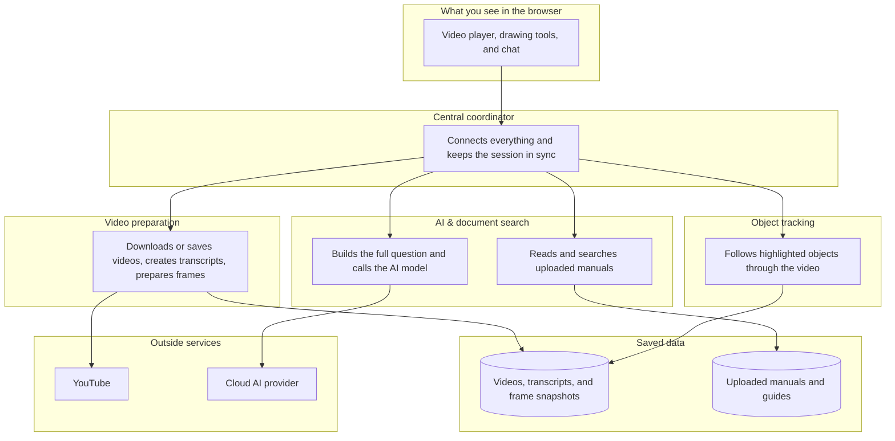
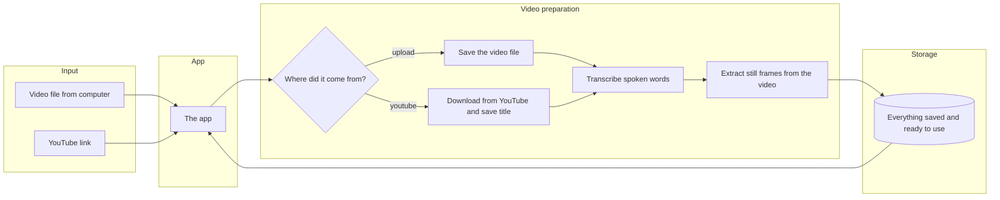
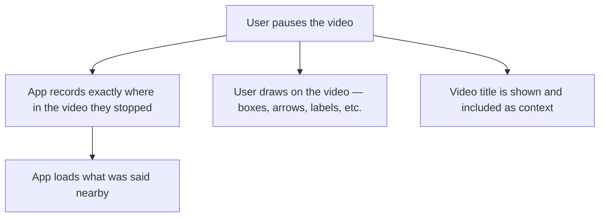
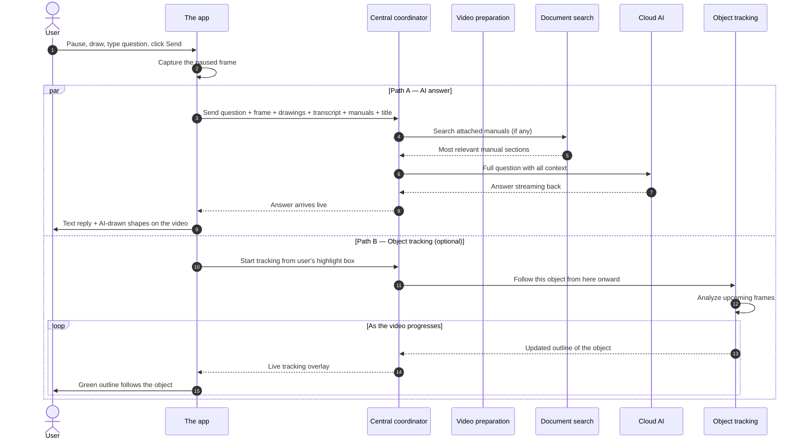
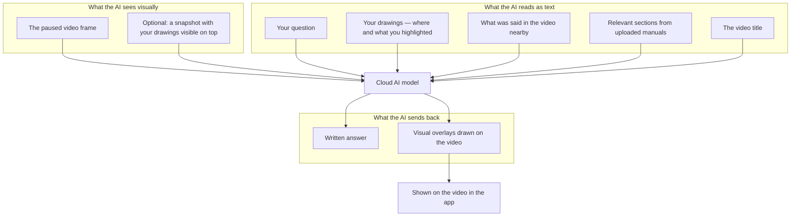
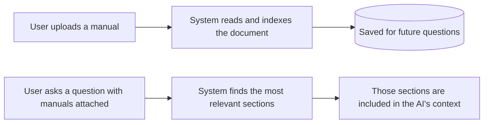
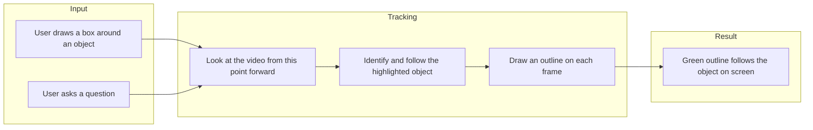

# OperatorOS — Project Overview

**Who this is for:** anyone new to the project — teammates, reviewers, stakeholders, or demo audiences  
**What you'll learn:** what OperatorOS does, how someone uses it, and how the system fits together behind the scenes

---

## 1. What is OperatorOS?

OperatorOS is an **AI assistant built around video**. It is designed for industrial training, machine walkthroughs, and operational learning — situations where someone is watching a tutorial and needs help understanding *exactly what they are looking at*.

It is **not** a generic chatbot. It understands:

- **What is on screen** at the moment you paused
- **What you pointed at** with your drawings and highlights
- **What was just said** in the video (spoken words near that moment)
- **What your manuals say** if you uploaded reference documents
- **How to explain the answer visually** by drawing back onto the video

The core idea in one sentence:

> Pause a training video, circle the part you care about, ask a question, and get a grounded answer — with optional visual overlays and object tracking.

---

## 2. What can someone do with it?

| What you can do | What it means |
|-----------------|---------------|
| **Load a video** | Upload a video file from your computer, or paste a YouTube link |
| **Watch and pause** | Play the video in the browser and stop at any moment |
| **Draw on the video** | Highlight areas with rectangles, arrows, pen strokes, text, and more |
| **Ask questions** | Chat about what you are looking at right now |
| **Attach manuals** | Upload PDFs, Word docs, or text files so answers can reference real documentation |
| **Get visual answers** | The AI can reply with text *and* draw shapes on the video to show what it means |
| **Track an object** | Optionally follow the thing you highlighted as the video continues *(still being polished)* |

---

## 3. How the system is organized

OperatorOS is made of several specialized parts that work together. Think of it like a team: one part handles the screen you see, another prepares videos, another reads manuals, another powers the AI, and another can track objects in the footage.



### What each part does (plain language)

| Part | Role |
|------|------|
| **The app (browser)** | Where you watch video, draw annotations, upload manuals, and chat |
| **Central coordinator** | Routes your actions to the right backend and streams results back live |
| **Video preparation** | Gets the video ready: saves it, transcribes speech, extracts still frames |
| **Document search** | Indexes uploaded manuals and finds the most relevant sections for your question |
| **AI brain** | Combines the paused frame, your drawings, transcript, manuals, and question — then asks the AI |
| **Object tracking** | Takes your highlight box and tries to follow that object forward in the video |

---

## 4. Step 1 — Loading a video

Before anyone can ask questions, the video needs to be loaded and prepared behind the scenes.



### What gets prepared for each video

| Prepared item | Why it matters |
|---------------|----------------|
| **The video file** | So you can play it back in the browser |
| **Video title** | Shown in the app and given to the AI for extra context (especially from YouTube) |
| **Transcript** | A text record of what was said, with timestamps — so the AI knows what was being explained at that moment |
| **Frame snapshots** | Still images pulled from the video — used for object tracking when needed |

### YouTube videos

If someone pastes a YouTube link, the system downloads the video, reads its title, transcribes the audio, and prepares everything the same way as an uploaded file. The title from YouTube (e.g. *"How to operate the CNC panel"*) helps the AI understand what kind of video it is looking at.

---

## 5. Step 2 — Pause, highlight, and get ready to ask

When someone pauses the video, the app captures the full context of that moment.



**Your drawings** are saved as structured information (not just pixels on screen), so the AI knows *what* you highlighted and *where* on the frame.

**Nearby speech** gives the AI conversational context — for example, if the instructor just said *"this valve controls pressure,"* that helps ground the answer.

**The video title** adds one more layer of context, especially useful for YouTube tutorials with descriptive titles.

---

## 6. Step 3 — Ask a question

When the user sends a question, **two things can happen at the same time**:

1. **Get an AI answer** — text plus optional drawings on the video  
2. **Track the highlighted object** — follow what they boxed as the video moves forward *(optional, still being improved)*



---

## 7. What information does the AI actually receive?

When you ask a question, the AI does not just see your typed words. It gets a rich picture of the moment you paused on.



### Why this matters

Most chat tools only see your words. OperatorOS also sees **the frame**, **your highlights**, **what was being said**, and **what the manual says** — all tied to the exact moment you paused. That is why answers can be specific instead of generic.

---

## 8. Uploading manuals and reference documents

Operators can upload technical documents — manuals, SOPs, safety guides — so answers are grounded in real documentation, not just the video.



You can attach or detach documents for each question — so a general walkthrough question might not need a manual, but a safety question can pull from the official SOP.

---

## 9. Object tracking (work in progress)

Object tracking lets the system **follow the thing you highlighted** as the video continues playing.



**Good to know:**

- Tracking runs **at the same time** as the chat answer — you do not have to wait for one to finish before getting the other.
- This feature is integrated but still being polished for speed and reliability in the full app experience.

---

## 10. The full journey at a glance

```
┌──────────────────────────────────────────────────────────────────────┐
│                         OPERATOROS — END TO END                       │
├──────────────────────────────────────────────────────────────────────┤
│ LOAD A VIDEO                                                          │
│   Upload a file  ──►  video is saved, speech transcribed, frames ready │
│   Paste YouTube  ──►  same preparation, plus title from YouTube        │
├──────────────────────────────────────────────────────────────────────┤
│ USE THE VIDEO                                                         │
│   Play  ──►  pause at the moment you care about                       │
│   Draw on screen to show exactly what you mean                        │
│   Optionally attach manuals for reference                             │
├──────────────────────────────────────────────────────────────────────┤
│ ASK A QUESTION (two things happen in parallel)                        │
│                                                                       │
│   A) AI answer                         B) Object tracking (optional)  │
│      • sees the paused frame              • starts from your highlight│
│      • reads your drawings                • follows the object ahead  │
│      • knows what was said                • draws a live outline      │
│      • searches attached manuals                                      │
│      → text answer + visual overlays on the video                   │
└──────────────────────────────────────────────────────────────────────┘
```

---

## 11. Where things stand today

| Feature | Status |
|---------|--------|
| Load videos (file upload or YouTube) | Working |
| Watch and pause in the browser | Working |
| Draw annotations on the video | Working |
| Ask questions and get streaming answers | Working |
| AI draws visual overlays on the video | Working |
| Speech transcription | Working |
| Video title shown and used as context | Working |
| Upload manuals and search them for answers | Built — full end-to-end testing still recommended |
| Object tracking in the video | Integrated — performance and user experience still being improved |

---

## 12. Summary for presenters

**Elevator pitch:**

OperatorOS lets someone pause an industrial training video, circle the exact part they mean, and ask a question. The system combines what is on screen, what was said nearby, what the manuals say, and what the user drew — then answers with text and visual overlays. Optionally, it can track that object forward in the video.

**Why it is different:**

Most tools do video *or* documents *or* chat. OperatorOS brings all of them together at a **specific moment in the video**, with **visual highlights** that show exactly what the user is asking about. That matches how people actually learn on the job — they pause, point, and ask.

**How it works in one sentence:**

You pause and highlight something on a training video; the app gathers everything relevant about that moment and asks an AI that can both explain in words and draw on the screen to show you what it means.

---

## 13. Demo walkthrough (for live presentations)

A simple story to tell while showing the app:

1. **Load** — Upload a machine tutorial or paste a YouTube link. Wait for the video to appear.
2. **Watch** — Play until something confusing appears on screen.
3. **Pause & point** — Stop the video and draw a box or arrow on the part you do not understand.
4. **Ask** — Type something like *"What does this do?"* or *"Is this the safety interlock?"*
5. **See the answer** — Read the reply in chat and watch the AI draw on the video to explain.
6. **Optional** — Upload a manual first, then ask a question that references it. Show how the answer pulls from the document.

That single flow — pause, point, ask — is the heart of OperatorOS.
